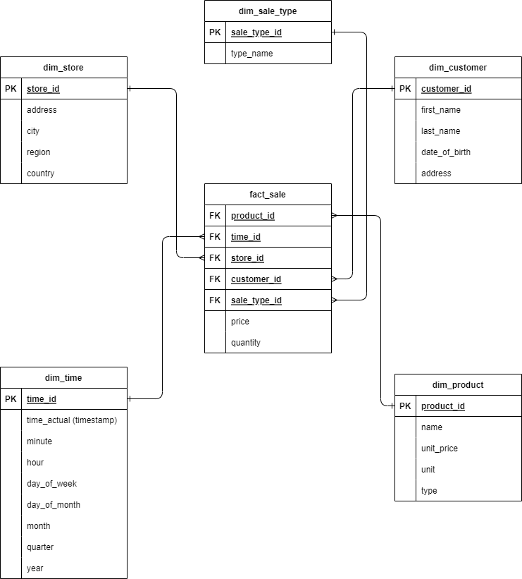
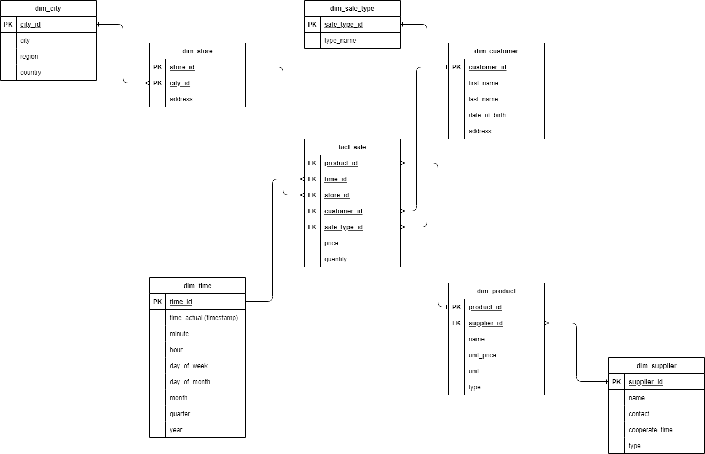
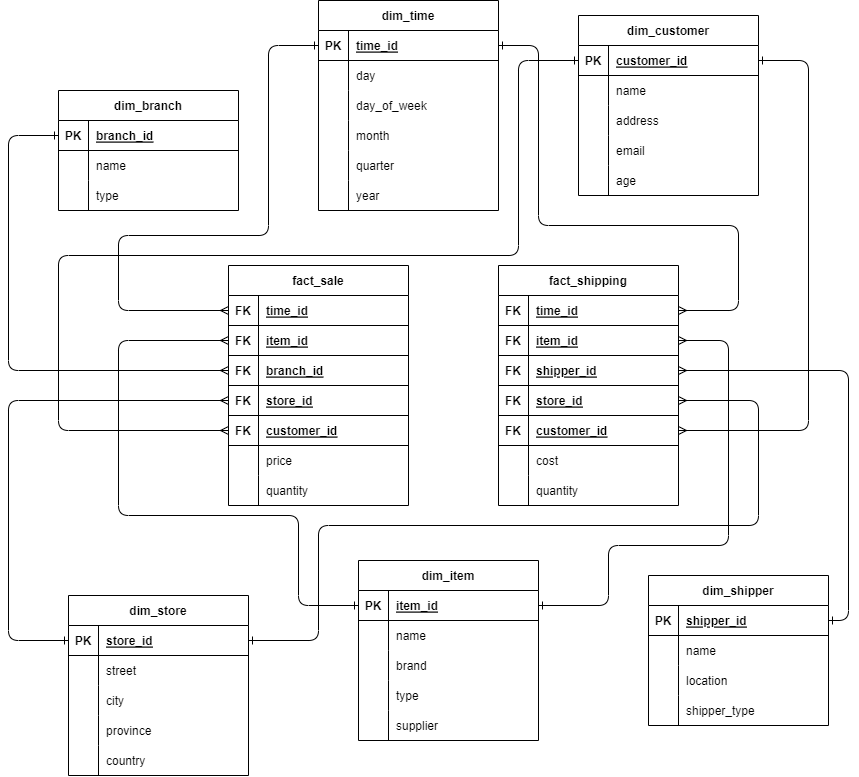

# Xây dựng kho dữ liệu cho hệ thống multi-chain

---

## Mục lục

[Tóm tắt đồ án](#tóm-tắt-đồ-án)

I. [Kho dữ liệu và cách thức triển khai](#i-kho-dữ-liệu-và-cách-thức-triển-khai)

1. [Giới thiệu về kho dữ liệu](#1-giới-thiệu-về-kho-dữ-liệu)

    1.1 [Khái niệm](#11-khái-niệm)

    1.2 [Các đặc tính của kho dữ liệu](#12-các-đặc-tính-của-kho-dữ-liệu)

    1.3 [Một số kiểu kho dữ liệu thường được áp dụng](#13-một-số-kiểu-kho-dữ-liệu-thường-được-áp-dụng)

2.[Xây dựng mô hình kho dữ liệu](#2-xây-dựng-mô-hình-kho-dữ-liệu)


[II. Bài toán phân tích dữ liệu hệ thống Multi-chain](#ii-bài-toán-phân-tích-dữ-liệu-hệ-thống-multi-chain)

[III. Triển khai giải pháp và áp dụng](#iii-triển-khai-giải-pháp-và-áp-dụng)

---

## Tóm tắt đồ án

## I. Kho dữ liệu và cách thức triển khai

### 1. Giới thiệu về kho dữ liệu

#### 1.1. Khái niệm

Kho dữ liệu (*Data Warehouse*) là một loại hệ thống quản lý dữ liệu được thiết kế để hỗ trợ các hoạt động kinh doanh thông minh (*Business Intelligence*), đặc biệt là phân tích dữ liệu.

Kho dữ liệu được sử dụng để giải quyết nhu cầu thực hiện các truy vấn và phân tích một lượng lớn dữ liệu lịch sử. Chẳng hạn như một cửa hàng bán quần áo muốn biết doanh thu trong từng tháng tiến triển ra sao, mẫu hàng nào có được doanh số tốt trong tháng vừa qua hay đánh giá mức độ thân thiết của các khách hàng từng mua. Hay là một nhà marketing muốn đánh giá và dự báo xu hướng mới để nắm bắt và đưa lên những ý tưởng mới cho đội ngũ sản xuất... Để làm được những công việc đó cần thực hiện truy xuất một lượng lớn dữ liệu có được trong quá khứ và kho dữ liệu là một giải pháp đáp ứng được những nhu cầu đó.

Dữ liệu trong kho dữ liệu thường được lấy từ nhiều nguồn khác nhau như tệp nhật ký ứng dụng và ứng dụng giao dịch,... sau đó được hợp nhất lại với nhau tạo nên một thể thống nhất. Khả năng phân tích của hệ thống cho phép các tổ chức rút ra những hiểu biết kinh doanh có giá trị từ dữ liệu của họ để cải thiện việc ra quyết định. Theo thời gian, kho dữ liệu xây dựng một bản ghi lịch sử đầy giá trị đối với các nhà khoa học dữ liệu và nhà phân tích kinh doanh.

#### 1.2. Các đặc tính của kho dữ liệu

Theo *William H. Inmon* - kiến trúc sư hàng đầu trong việc xây dựng hệ thống kho dữ liệu, đã đưa ra định nghĩa chuyên sâu và rõ ràng hơn về kho dữ liệu rằng đây là một bộ các dữ liệu hướng đối tượng (***subject-oriented***), tích hợp (***integrated***), phụ thuộc theo thời gian (***time-variant***) và không bị thay đổi (***nonvolatile***) để  hỗ  trợ cho quá trình đưa ra quyết định. Một định nghĩa ngắn gọn nhưng chứa trọn bốn điểm nhấn làm rõ sự khác biệt giữa một hệ thống kho dữ liệu và một hệ thống lưu trữ thông thường - một hệ cơ sở dữ liệu quan hệ, các hệ thống giao dịch, hệ thống file lưu trữ,...

* **Hướng đối tượng** - *Subject-oriented*: Với bài toán chính là phân tích, kho dữ liệu được tổng hợp và tổ chức xoay quanh các chủ đề  chính như khách hàng, sản phẩm, các nhà cung ứng, doanh thu. Thay vì chú trọng vào quá trình xử lý các giao dịch của tổ chức, kho dữ liệu tập trung vào quá trình tạo lập các mô hình và phân tích dữ liệu cho các nhà phân tích. Vì vậy, kho dữ liệu thường cung cấp những cái nhìn có chiều sâu vào vào các vấn đề cụ thể nhờ sự chọn lọc những dữ liệu cần thiết cho quá trình ra quyết định.

* **Tích hợp** - *Integrated*: Kho dữ liệu thường được xây dựng bằng cách tích hợp nhiều nguồn không đồng nhất, chẳng hạn như cơ sở dữ liệu quan hệ, các file và bản ghi giao dịch trực tuyến. Cũng vì thế  mà các kỹ thuật làm sạch và tích hợp dữ liệu được áp dụng để đảm bảo tính nhất quán trong quy ước đặt tên, cấu trúc mã hóa, thước đo thuộc tính,...

* **Phụ thuộc thời gian** - *Time-variant*: Dữ liệu được lưu trữ sẽ cung cấp những tri thức theo góc độ thời gian như 5 năm kể từ ngày bán hàng, tình hình tổ chức thường niên, các quý,... đem lại một cái nhìn toàn diện về những khoảng thời gian mà nhà phân tích mong muốn.

* **Không thay đổi** - *Nonvolatile*: Kho dữ liệu sẽ luôn là một nơi chứa riêng biệt về mặt vật lý được chuyển đổi từ mọi dữ liệu tiếp nhận được từ nhiều nguồn. Do sự tách biệt này nên các cơ chế xử lý giao dịch, khôi phục và kiểm soát đồng thời trong kho dữ liệu không phải là yêu cầu bắt buộc. Nó thường chỉ yêu cầu hai thao tác truy cập dữ liệu: thêm mới dữ liệu và truy cập dữ liệu.

Tựu chung lại, xây dựng kho dữ liệu tức áp dụng một kiểu kiến trúc lưu trữ dữ liệu từ nhiều nguồn một cách nhất quán để triển khai hạ tầng vật lý cho mô hình dữ liệu nhằm đáp ứng nhu cầu phân tích, báo cáo và hỗ trợ ra quyết định cho tổ chức, doanh nghiệp.

#### 1.3 Một số kiểu kho dữ liệu thường được áp dụng

Phụ thuộc vào bài toán cần giải quyết, kho dữ liệu cũng cần được triển khai một cách phù hợp vừa để giải quyết bài toán, đáp ứng nhu cầu và còn cần để đáp ứng được điều kiện triển khai giải pháp.

**Kho dữ liệu doanh nghiệp**: Đây là kiếu kho dữ liệu tập trung, phân tích tất cả thông tin về các chủ đề liên quan đến tổ chức, doanh nghiệp. Giải pháp này cung cấp tính khả dụng và khả năng truy cập đến với nguồn dữ liệu xuyên suốt trong toàn bộ tổ chức. Thông thường, nó chứa dữ liệu chi tiết cũng như dữ liệu tổng hợp. Nguồn cũng cấp dữ liệu cho doanh nghiệp có thể là từ các hệ thống vận hành hay giao dịch (các hệ thống ERP, CRM, ứng dụng, các thiết bị IoT,...). Dung lượng dữ liệu có kích thước có thể lên đến từ vài gigabyte (GB) đến hàng trăm gigabyte, terabyte hoặc thậm chí nhiều hơn. Một kho dữ liệu doanh nghiệp có thể được triển khai trên máy tính, server truyền thống hoặc các nền tảng kiến trúc song song. Tuy nhiên, nó yêu cầu mô hình kinh doanh chi tiết và có thể mất nhiều năm để thiết kế và xây dựng.

**Data mart**: Giả sử như ta có một kho dữ liệu khổng lồ được mọi cá nhân trong tổ chức sử dụng. Người làm tiếp thị cần sử dụng dữ liệu để phân tích thì cần những dữ liệu liên quan đến khách hàng, sản phẩm, doanh thu,... để đưa ra những chiến lược phù hợp cho hoạt động kinh doanh. Trong khi đó, người làm quản lý nhân sự trong tổ chức thì cần sử dụng những dữ liệu về nhân sự, thành tích, khảo sát, chi phí, tuyển dụng,... để nắm rõ tình hình nội tại từ đó đưa ra những quyết định, chiến lược để cải thiện chất lượng nhân sự, văn hóa doanh nghiệp. Mỗi một vai trò công việc cần sử dụng những dữ liệu chủ đề khác nhau. Đáp ứng điều đó, data mart là một chiến lược áp dụng tốt khi sử dụng những kho dữ liệu nhỏ được phân loại theo hướng chủ đề như bán hàng, nhân sự, tài chính,... trong một tổ chức. Data mart thường được triển khai trên các máy chủ chi phí thấp dựa trên Unix/Linux hoặc Windows. Chu kỳ triển khai của một siêu thị dữ liệu có nhiều khả năng được đo bằng tuần hơn là tháng hoặc năm. Tuy nhiên, nó có thể liên quan đến sự tích hợp phức tạp trong thời gian dài nếu thiết kế và lập kế hoạch của nó không áp dụng cho toàn doanh nghiệp. Tùy thuộc vào nguồn dữ liệu, data mart có thể được thiết kế độc lập hay là phụ thuộc vào kho dữ liệu tổng của doanh nghiệp. Các data mart độc lập sẽ được cung cấp dữ liệu từ một hoặc nhiều hệ thống vận hành bên ngoài hoặc cục bộ trong một bộ phận cụ thể. Data mart phụ thuộc được coi là một thành phần con trong kho dữ liệu của doanh nghiệp.

### 2. Xây dựng mô hình kho dữ liệu

#### 2.1 Kĩ thuật mô hình hóa đa chiều

Kho dữ liệu là nơi tập trung một khối lượng lớn dữ liệu với mục tiêu giải quyết các bài toán thực tiễn mà doanh nghiệp gặp phải thông qua việc phân tích dữ liệu lịch sử (*business intelligence*). Quá trình xây dựng kho dữ liệu sẽ đi song hành với nhu cầu phân tích kinh doanh của tổ chức. Từ việc làm sao để truy cập được vào dữ liệu lớn, làm sao truy vấn được một cách dễ dàng,... cho đến việc làm sao để đưa ra những điểm nhấn quan trọng (*insights*) và làm sao để hỗ trợ việc ra quyết định chuẩn xác nhất, đáng tin cậy nhất. Và cuối cùng, có một phương pháp đã được rộng rãi các kĩ sư dữ liệu đánh giá cao trong việc mô hình hóa kho dữ liệu để đảm bảo được hai tiêu chí quan trọng: Dữ liệu truy vấn **dễ hiểu, dễ tiếp cận** đối với người dùng. Kĩ thuật đó được gọi với cái tên **Dimension Modeling** hay tạm dịch là Mô hình hóa đa chiều.

Kĩ thuật mô hình hóa đa chiều giúp người thiết kế kho dữ liệu nhanh chóng tạo nên các lược đồ cơ sở dữ liệu dễ hiểu để các nhà phân tích có thể khai thác tốt cho nhu cầu của mình. Ở các cơ sở dữ liệu vận hành, ta cần chuẩn hóa kĩ càng các lược đồ thành 2NF, 3NF, BCNF, ... để đảm bảo dữ liệu luôn đảm bảo tính nhất quán và toàn vẹn dữ liệu, phục vụ cho việc thực thi và xử lý cho các giao dịch trực tuyến. Các bảng dữ liệu cũng sẽ có kích thước và khối lượng vừa phải, thuận tiện trong việc thực hiện các thao tác CRUD. Tuy nhiên, trong kho dữ liệu, khối lượng và kích thước của dữ liệu sẽ ngày càng tăng lên. Việc chuẩn hóa dữ liệu chặt chẽ sẽ dẫn đến khó khăn trong việc mở rộng mô hình, mất đi ý nghĩa phân tích chuyên sâu mà kho dữ liệu cần đáp ứng và độ phức tạp của truy vấn sẽ là điều không thể tránh khỏi. Kĩ thuật hóa đa chiều đánh giá các yếu tố như các thứ nguyên để nhìn nhận sự phân tích (*dimensions*) - đại diện cho các thực thể kinh doanh và chủ điểm phân tích (*facts*) - đại diện cho các phép đo. Hai yếu tố này kết hợp với nhau tạo nên những mức độ biểu thị linh hoạt cho các tri thức khác nhau thu được từ dữ liệu. Áp dụng kĩ thuật mô hình hóa đa chiều khi tạo nên các lược đồ dữ liệu tạo nên một số mô hình có thể kể đến như sau: *lược đồ hình sao (star-schema)*, *lược đồ hình bông tuyết (snowflakes-schema)*, *lược đồ thiên hà (galaxy-schema)*.

##### 2.1.1 Lược đồ hình sao

Mô hình dữ liệu đa chiều được triển khai trên các cơ sở dữ liệu quan hệ sẽ có cấu trúc giống như hình sao - *star-schema*. Với bảng dữ liệu của chủ điểm phân tích (*facts*) ở giữa chứa lượng lớn bản ghi độc lập và được liên kết với một nhóm các bảng tương ứng với các thứ nguyên. Lược đồ của kho dữ liệu tương ứng với một chủ điểm phân tích vì thế sẽ có hình dạng sao và được dùng làm tên gọi cho mô hình.



Ta lấy ví dụ về một lược đồ xây dựng kho dữ liệu đơn giản cho một công ty tên ABC với mong muốn phân tích được tình hình kinh doanh của trên toàn bộ chuỗi cửa hàng với lược đồ ở phía trên. Đây là một minh họa cho lược đồ hình sao với chủ điểm phân tích nằm ở bảng *fact_sale* chứa một lượng dữ liệu. Trong bảng, các trường gồm có các phép đo lường như *price*, *quantity* và các trường khóa ngoại liên kết với các bảng các thứ nguyên gồm *dim\_time*, *dim\_product*, *dim\_store*, *dim\_customer*, *dim\_sale\_type*.

Như vậy ta thấy được rằng lược đồ hình sao là một lược đồ dễ dàng để triển khai và xây dựng. Quá trình trính xuất, biến đổi và tải (**ETL** - *Extract, Transform, Load*) được đơn giản hóa khi mà dữ liệu vừa được tải vào bảng fact và tải trực tiếp vào các bảng thứ nguyên dựa theo giá trị của các khóa ngoại. Không chỉ vậy, sử dụng lược đồ hình sao cũng tạo nên nhiều thuận tiện trong quá trình phân tích. Việc phân tích các chủ điểm phân tích ta sẽ sử dụng chủ yếu các phép JOIN và các toán tử tổng hợp như COUNT, SUM,... dựa theo một số phép đo đã được tính toán trong bảng fact. Người phân tích có thể thực hiện tốt các phân tích đi từ tổng quát đến chi tiết qua các phép truy vấn JOIN giữa bảng fact và các bảng dim khác nhau. Chẳng hạn với ví dụ lược đò ở trên, ngoài việc ta có thể biết được doanh thu của toàn bộ cửa hàng trong một quý là bao nhiêu:

```sql
SELECT SUM(price)
FROM fact_sale fs
JOIN dim_time dt
USING (time_id)
WHERE dt.quarter = 2

```

ta còn có thể biết được thêm trong quý đó, cửa hàng nào ở thành phố *A* là có doanh số tốt nhất:

```sql
SELECT ds.store_id AS store, SUM(quantity) AS quantities_in_quarter_2
FROM fact_sale fs
JOIN dim_time dt
ON fs.time_id = dt.time_id
JOIN dim_store ds
ON fa.store_id = ds.store_id
WHERE dt.quarter = 2
    AND ds.city = 'A'
GROUP BY ds.store_id
ORDER BY quantities_in_quarter_2
```

Tùy vào mức độ chi tiết của câu hỏi, câu truy vấn sẽ cần thực hiện một só phép JOIN nhất định. Mặc dù cần thực hiện nhiều phép truy vấn như vậy nhưng nhờ vào việc cấu trúc của lược đồ hình sao là đơn giản nên việc thực hiện các phép truy vấn phức tạp vẫn duy trì một tốc độ rất tốt và hiệu quả.

Tuy nhiên, cũng vì sự đơn giản đó mà lược đồ hình sao không thể đảm bảo được tính giảm thiểu đi dư thừa dữ liệu nằm ở các bảng thứ nguyên. Giả sư như trong bảng *dim\_store*, trường *country* chắc chắn sẽ có nhiều dữ liệu lặp đi lặp lại và chi phí bộ nhớ sẽ là đáng kể nếu như bảng có số lượng bản ghi lớn. Chưa kể đến việc mối quan hệ giữa bảng dim-fact là mối quan hệ nhiều-nhiều (*many-to-many*) sẽ là một bài toán khó hơn cho lược đồ này.

##### 2.1.2 Lược đồ bông tuyết

Lược đồ bông tuyết là có ý tưởng giống như lược đồ hình sao nhưng có chút cải biên ở trong phần mở rộng cho các bảng thứ nguyên. Các bảng thứ nguyên (bảng dim) sẽ tiếp tục được chuẩn hóa và chia thành các bảng thứ nguyên con phân cấp. Tiếp tục lấy lại ví dụ trên với chủ điểm phân tích về doanh thu của công ty ABC, ta sẽ tiếp tục thực hiện chuẩn hóa ở một số bảng thứ nguyên như *dim_store*, *dim_product*:



Trên đây là ví dụ cho một cách chuẩn hóa lại lược đồ hình sao ở phía trên. Ngoài ra, lược đồ trên có thể tiếp tục chuẩn hóa tiếp ở bảng *dim_city*, *dim_time*,... tùy vào yêu cầu mức độ chuẩn hóa chi tiết đến đâu. Lược đồ bông tuyết đã phần nào giải quyết được sự dư thừa dữ liệu tồn tại trong lược đồ hình sao và nâng cao khả năng có thể mở rộng cho kho dữ liệu. Tuy nhiên, cấu trúc của lược đồ sẽ trở nên phức tạp hơn, dẫn đến các câu truy vấn trở nên cồng kềnh và phức tạp hơn để giải quyết câu hỏi so với lược đồ hình sao.

##### 2.1.3 Lược đồ thiên hà

Với các lược đồ phía trên, ta vẫn đang xét trường hợp sử dụng lược đò hình sao và bông tuyết gói gọn trong một chủ điểm phân tích. Tuy nhiên với một số trường hợp đặc biệt, các tổ chức doanh nghiệp cần để tâm tới nhiều hơn một chủ điểm phân tích (ví dụ như một cửa hàng ngoài việc đánh giá về tình hình kinh doanh trong thời gian qua còn muốn đánh giá thêm về các chi phí trong quá trình hoạt động,...). Nhu cầu đó đã nảy sinh thêm một lược đồ mới cũng với mô tuýp dim-fact nhưng có nhiều hơn một chủ điểm phân tích gọi là lược đồ hình sao (*galaxy-schema*). Đây là một lược đồ phức tạp và có phần linh hoạt hơn, bao gồm nhiều bảng chủ điểm phân tích dùng chung các bảng bảng thứ nguyên. Các bảng chủ điểm phân tích chứa các mức độ chi tiết khác nhau hoặc các quan điểm khác nhau của các dữ kiện. Ví dụ: một bảng thực tế có thể chứa dữ liệu bán hàng hàng ngày, trong khi một bảng thực tế khác có thể chứa dữ liệu hàng tồn kho hàng tháng. Các bảng thứ nguyên chứa các thuộc tính chung có thể được sử dụng để nối các bảng thực tế. Các mối quan hệ phức tạp trên lược đồ được giống như một chòm sao, với nhiều ngôi sao được kết nối bởi các bảng thứ nguyên được chia sẻ. Lược đồ thiên hà cho phép phân tích các sự kiện chi tiết và đa dạng hơn trên nhiều về mục tiêu lẫn điểm nhìn.



Lược đồ thiên hà cũng sẽ giúp kho dữ liệu đảm bảo tính toàn vẹn và giảm thiểu tính dư thừa dữ liệu giống như hai lược đồ ở trước. Tuy vậy, ta có thể thấy để truy vấn dữ liệu chuyên sâu trong lược đồ trên khá phức tạp, gây khó khăn trong việc tối ưu hóa truy vấn.

#### 2.2 Các giai đoạn trong thiết kế lược đồ


### 3. Các kiến trúc kho dữ liệu thường gặp

## II. Bài toán phân tích dữ liệu hệ thống Multi-chain

## III. Triển khai giải pháp và áp dụng

## Tài liệu tham khảo

[Oracle, What is a data warehouse (oracle1)](https://www.oracle.com/database/what-is-a-data-warehouse/)

[W. H. Inmon, Building the Data Warehouse, John Wiley & Sons, 1996 (inm96)]()

[Ralph Kimball, Margy Ross, The Data Warehouse Toolkit, John Wiley & Sons, 3rd Edition, 2013]()